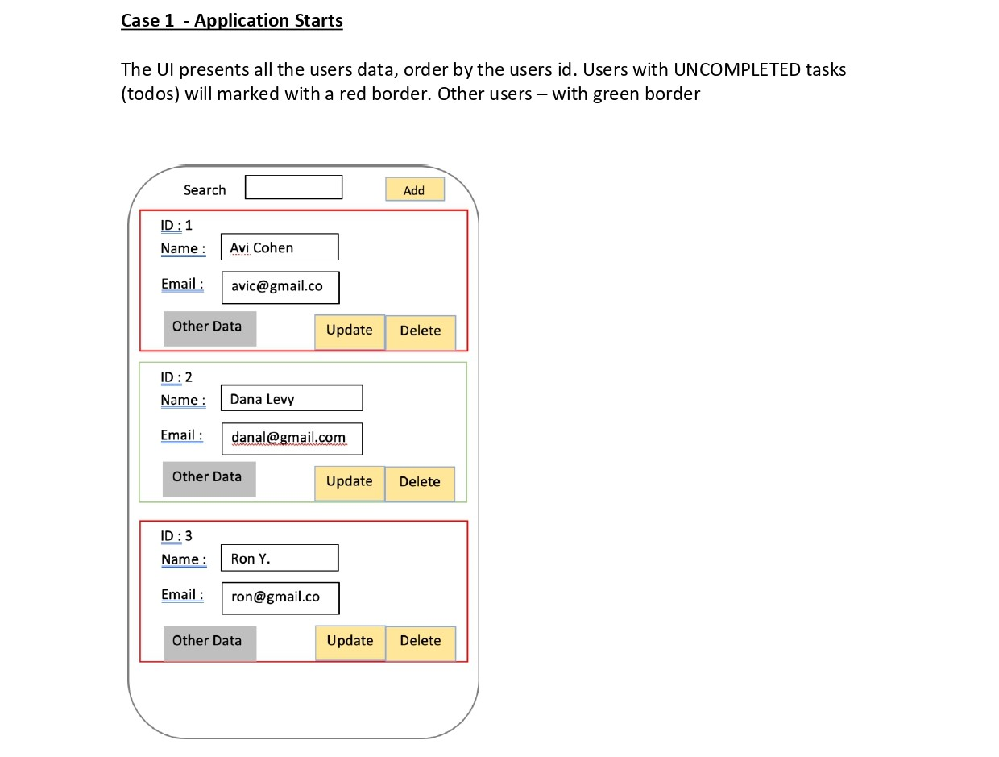
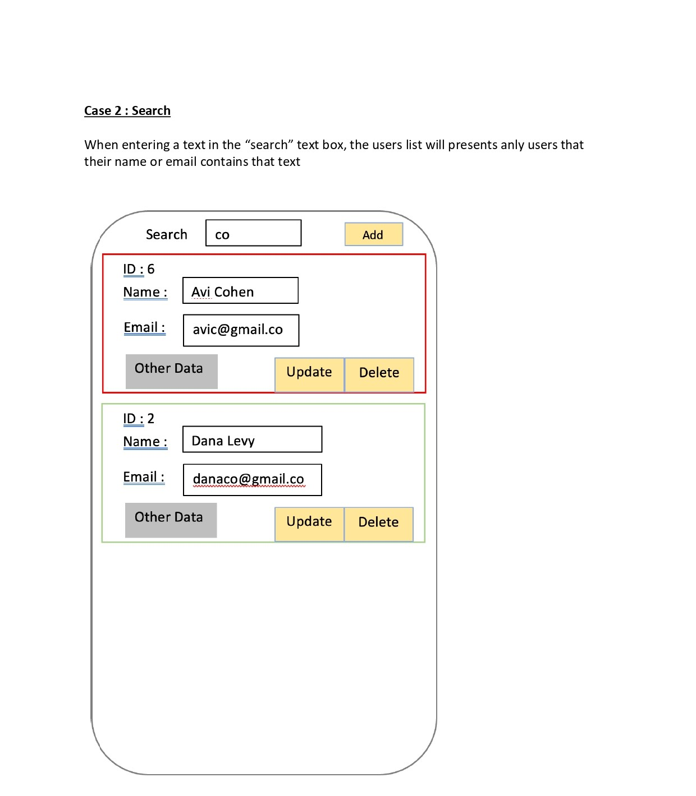
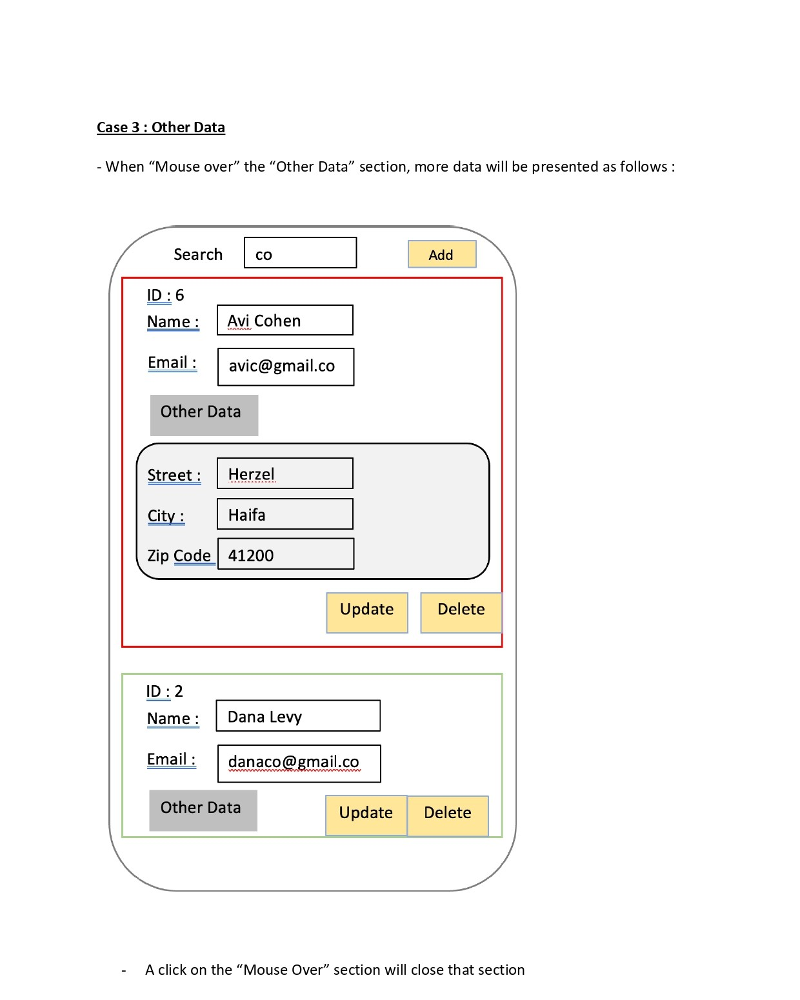
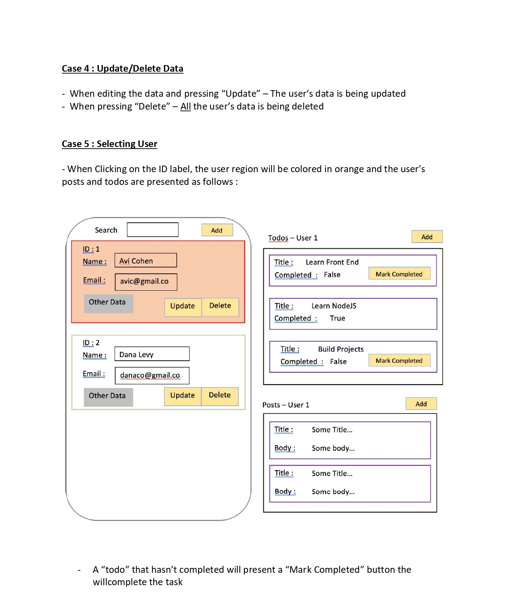
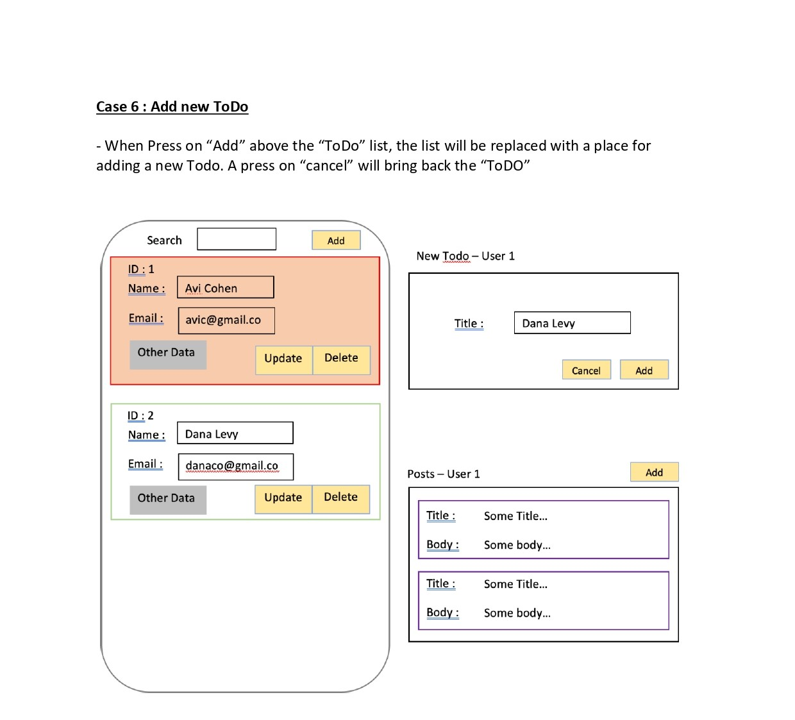
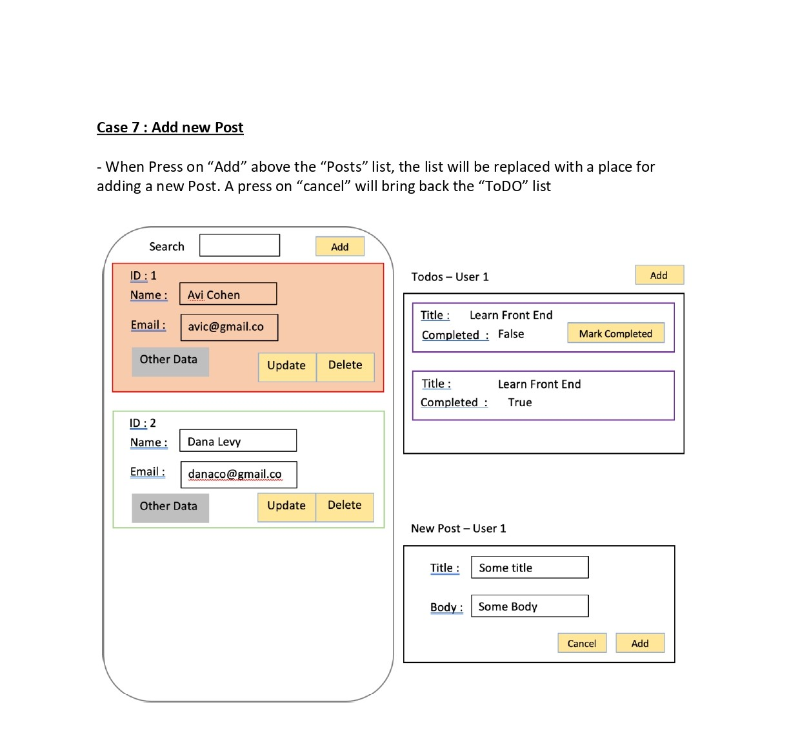
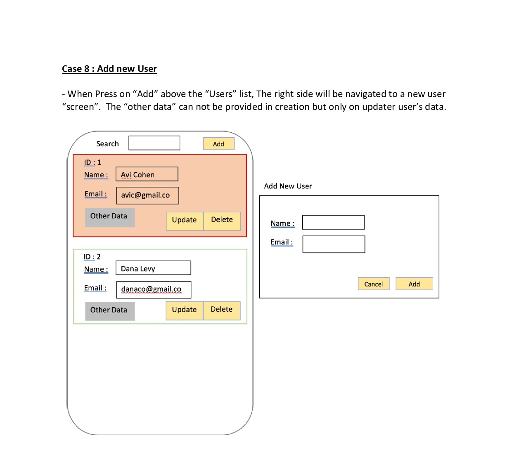

# Data Base Manager

# 🗂️ Table of Contents

- [Overview](#overview)
- [Libraries and Tools](#libraries-and-tools)
- [Getting Started](#getting-started)

## Overview

This Project based on the (server) data provided by : 
- https://jsonplaceholder.typicode.com/users
- https://jsonplaceholder.typicode.com/posts
- https://jsonplaceholder.typicode.com/todos

Management a “Data Base” on the client side, based and initialized by the server data from those links.

***

## Libraries and Tools

- **Vite**: A build tool that provides a fast development environment.
- **React**: A JavaScript library for building user interfaces.
- **CSS**: For styling the website.
- **API**: Used to fetch data as needed.
- **Axios**: A promise-based HTTP client for making requests to APIs.

## Getting Started

To get started with the project, follow these steps:

1. Clone the repository to your local machine.
2. Navigate into the project directory.
3. Run `npm install` to install the necessary packages.
4. Execute `npm run dev` to start the local development server.
